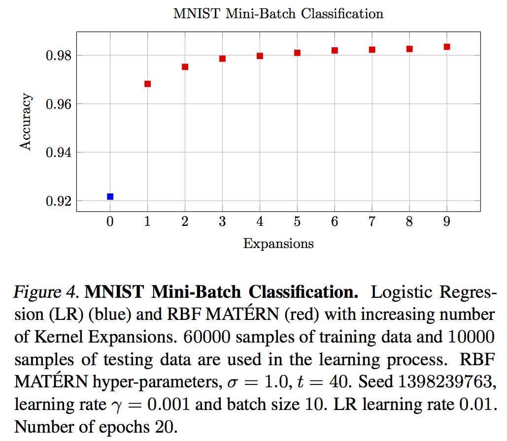

# McKernel

McKernel: Approximate Kernel Expansions in Log-linear Time through Randomization.

For more information about the library, visit the website:

  http://www.curto.hk/publication/mckernel/

If you use McKernel in a publication, please cite the paper below:

Curtó, J. D. and Zarza, I. C.
McKernel: Approximate Kernel Expansions in Log-linear Time through Randomization. 2019.

--------------------------------------------------------
Change Log
--------------------------------------------------------

Version 1.1, released on 24/01/2019

Version 1.0, released on 12/05/2018

--------------------------------------------------------
File Information
--------------------------------------------------------

- Standard (standard/mckernel)
       Library McKernel.
- Standard+ (sdd+/mckernel)
       Library McKernel. Pseudo-random numbers generated with hash functions. Suitable for distributed applications. Recommended.
