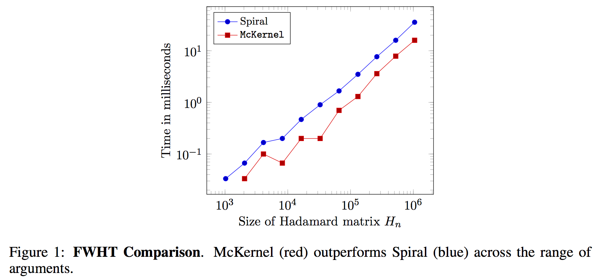
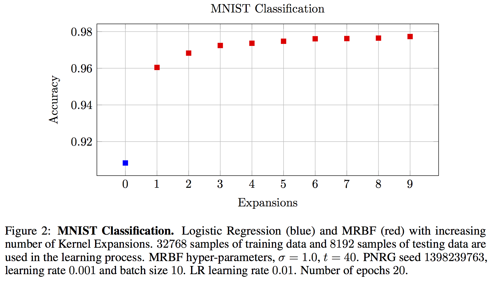
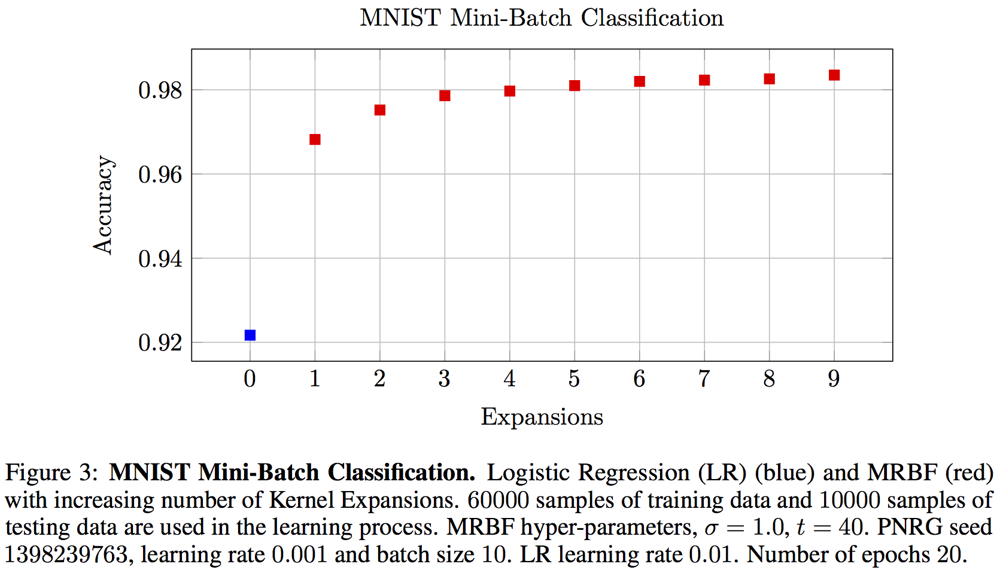

# McKernel

McKernel: A Library for Approximate Kernel Expansions in Log-linear Time.

Winston S. Churchill - 'We shall never surrender'

For more information about the library, visit the website:

  http://www.curto.hk/publication/mckernel/

If you use McKernel in a publication, please cite the paper below:

Curtó, J. D., Zarza, I. C., Yang, F., Smola, A., De La Torre, F., Ngo, C. W., Van Gool, L.
McKernel: A Library for Approximate Kernel Expansions in Log-linear Time. 2017.

--------------------------------------------------------
Change Log
--------------------------------------------------------

Version 1.0, released on 12/05/2018

--------------------------------------------------------
File Information
--------------------------------------------------------

- Standard (standard/mckernel)
       Library McKernel.
- Standard+ (sdd+/mckernel)
       Library McKernel. PRNGs generated with hash functions. Suitable for distributed applications. Recommended.
