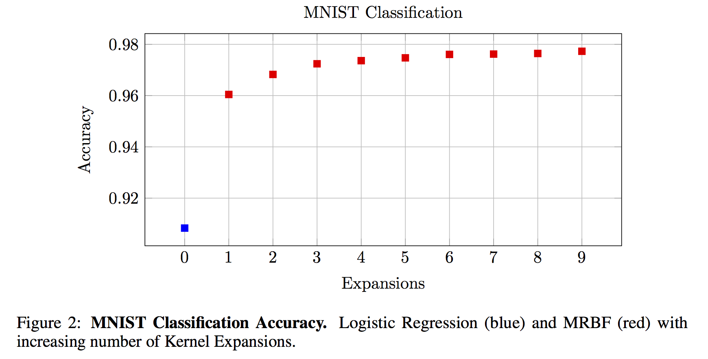

# McKernel

McKernel: A Library for Approximate Kernel Expansions in Log-linear Time.

Curtó, J. D., Zarza, I. C., Yang, F., Smola, A. J., De La Torre, F., Ngo, C. W., Van Gool, L. 
McKernel: A Library for Approximate Kernel Expansions in Log-linear Time. 2017.
