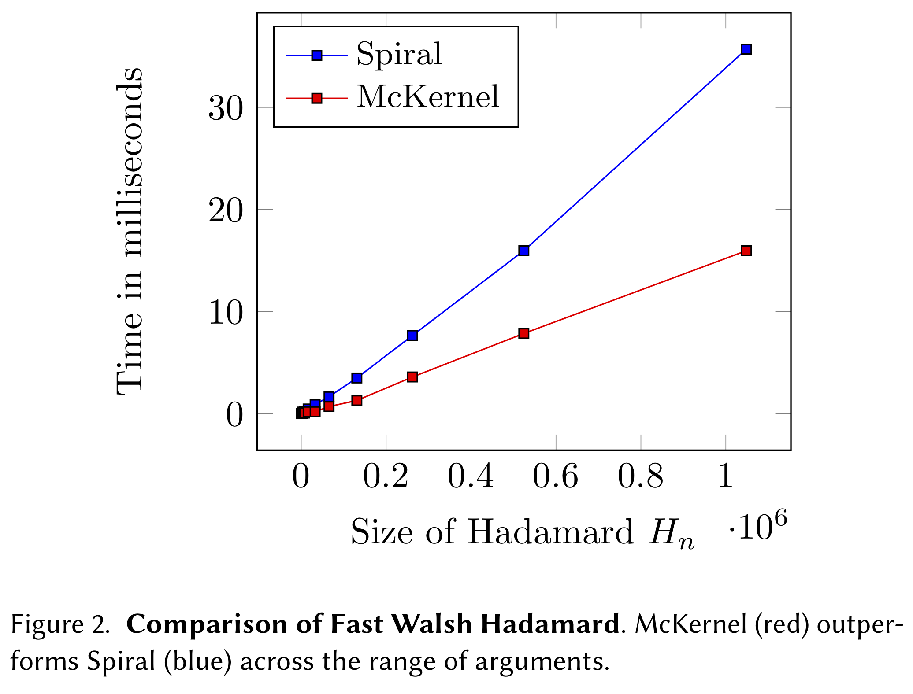

# McKernel

McKernel: A Library for Approximate Kernel Expansions in Log-linear Time.

For more information about the library, visit the website:

  www.decurto.tw

If you use McKernel in a publication, please cite the paper below:

        @article{Curto17,
          author = "J. D. Curt\'o and I. C. Zarza and F. Yang and A. Smola and F. Torre and C. W. Ngo and L. Gool",
          title = "{McKernel}: A Library for Approximate Kernel Expansions in Log-linear Time",
          journal = "arXiv:1702.08159",
          year = "2017",
        }

--------------------------------------------------------
Change Log
--------------------------------------------------------

Version 2.2, released on 06/06/2019.

Version 2.1, released on 04/06/2019.

Version 2.0, released on 26/03/2019.

Version 1.1, released on 24/01/2019.

Version 1.0, released on 12/05/2018.

--------------------------------------------------------
File Information
--------------------------------------------------------

- Standard (mckernel/standard).
  - Library McKernel.
- Standard+ (mckernel/sdd+).
  - Library McKernel. Pseudo-random numbers generated with functions of hashing. Suitable for distributed applications. Recommended.
- Learning (mckernel/lg).
  - DL framework to reproduce experiments in the paper.
