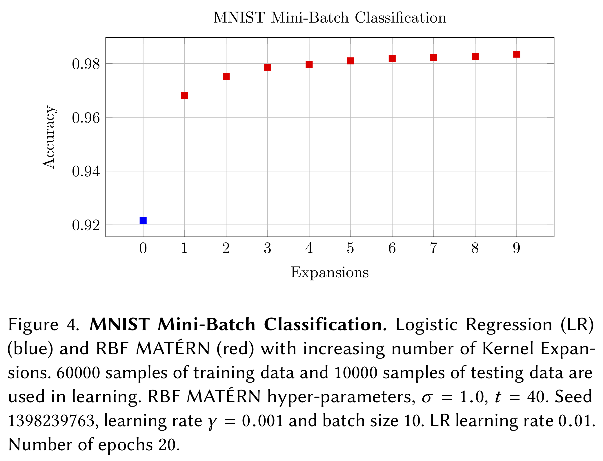

# McKernel

McKernel: A Library for Approximate Kernel Expansions in Log-linear Time.

J. de Curtò, I. de Zarzà, Hong Yan, Carlos T. Calafate (2022) On the applicability of the Hadamard as an input modulator for problems of classification [Source Code]. https://doi.org/10.24433/CO.3851581.v1

--------------------------------------------------------
Change Log
--------------------------------------------------------

Version 2.2, released on 06/06/2019.

Version 2.1, released on 04/06/2019.

Version 2.0, released on 26/03/2019.

Version 1.1, released on 24/01/2019.

Version 1.0, released on 12/05/2018.

--------------------------------------------------------
File Information
--------------------------------------------------------

- Standard (mckernel/standard).
  - Library McKernel.
- Standard+ (mckernel/sdd+).
  - Library McKernel. Pseudo-random numbers generated with functions of hashing. Suitable for distributed applications. Recommended.
- Learning (mckernel/lg).
  - DL framework to reproduce experiments in the paper.
